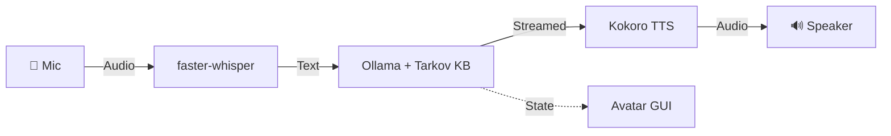

# PMC Overwatch — Tarkov AI Companion

> Real-time AI voice companion for Escape from Tarkov. Speak naturally, get instant voice responses with accurate quest knowledge. **Runs entirely offline on macOS.**

## ✨ Features

| Feature | Description |
|---------|-------------|
| **🎙 Voice Chat** | Speech → AI → Voice pipeline with natural conversation |
| **🧠 Tarkov Expert** | Accurate quest info, map extracts, ammo tiers, boss locations |
| **🎤 Offline STT** | faster-whisper speech recognition (local) |
| **🔊 Neural TTS** | Kokoro ONNX — warm, natural female voice |
| **👩 Animated Avatar** | VTuber-style with voice-reactive bars + glow effects |
| **📺 Twitch Bot** | Optional Twitch chat integration |

## 🛠 Tech Stack

| Layer | Technology |
|-------|-----------|
| LLM | [Ollama](https://ollama.ai) — `qwen2.5:3b` with Tarkov knowledge base |
| TTS | [Kokoro ONNX](https://github.com/thewh1teagle/kokoro-onnx) — neural voice |
| STT | [faster-whisper](https://github.com/SYSTRAN/faster-whisper) — CTranslate2 |
| GUI | [CustomTkinter](https://github.com/TomSchimansky/CustomTkinter) + Canvas |

##  Quick Start

```bash
git clone https://github.com/Bossiq/Tarkov_AI_Frriend.git
cd Tarkov_AI_Frriend
python3 -m venv venv && source venv/bin/activate
pip install -r requirements.txt
cp .env.example .env
ollama pull qwen2.5:3b
python main.py
```

## ⚙️ Configuration

| Variable | Default | Description |
|----------|---------|-------------|
| `OLLAMA_MODEL` | `qwen2.5:3b` | LLM model (2GB, fast + accurate) |
| `OLLAMA_NUM_CTX` | `2048` | Context window |
| `TTS_VOICE` | `af_heart` | Kokoro voice ID |
| `TTS_SPEED` | `1.2` | Speech speed |

## 📁 Project Structure

```
├── main.py             # Entry point — orchestrates everything
├── brain.py            # AI brain (Ollama + Tarkov knowledge + memory)
├── tarkov_data.py      # Quest reference data (injected into LLM context)
├── voice_input.py      # Mic capture + adaptive VAD + Whisper STT
├── voice_output.py     # Kokoro TTS + async sentence pipeline
├── gui.py              # Animated avatar with voice-reactive effects
├── twitch_bot.py       # Optional Twitch chat integration
├── video_capture.py    # Optional webcam capture
├── logging_config.py   # Centralized logging
├── assets/avatar.png   # AI companion avatar
├── .env.example        # Environment template
└── requirements.txt    # Dependencies
```

## 🏗 Architecture



### Design Decisions

- **Single Avatar + Effects**: One consistent image with animated voice bars and glow ring — no jarring frame swapping
- **Tarkov Knowledge Base**: Quest data injected into LLM context so even small models answer correctly
- **Adaptive Silence**: Mic detects silence relative to your speech volume, not absolute threshold
- **Python**: Bottleneck is LLM inference (native C++) — Python just orchestrates

## 📄 License

MIT — see [LICENSE](LICENSE).

---
*Built by [Bossiq](https://github.com/Bossiq)*
