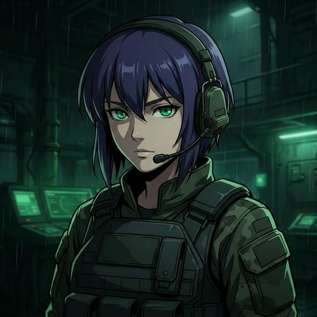

<p align="center">
  
</p>

<h1 align="center">PMC Overwatch</h1>

<p align="center">
  <strong>Real-time AI voice companion for Escape from Tarkov streaming</strong><br/>
  3D Animated Mascot • Triple-Engine LLM • Neural Voice • Twitch Integration<br/>
  <sub>v0.26.0</sub>
</p>

<p align="center">
  
  
  
  
  
  
  
</p>

---

## What Is This?

PMC Overwatch is an **AI-powered voice companion** designed for Escape from Tarkov live-streaming on Twitch. It runs as a headless voice engine with a 3D animated mascot overlay for OBS — think of it as a virtual co-host that listens, talks back, reacts to gameplay, and interacts with Twitch chat.

**Key highlights:**
- 🎙️ Speaks back in real-time with Microsoft Neural Voices (edge-tts)
- 🧠 Triple-engine LLM with automatic failover (Groq → Gemini → Ollama)
- 🎮 Deep Tarkov knowledge: quests, maps, ammo tables, bosses, flee market prices
- 🤖 3D animated mascot with Mixamo motion-captured animations in OBS
- 🔊 Neural voice activity detection (Silero VAD) with barge-in support
- 🌐 Trilingual: English, Russian, Romanian with auto-detection

---

## Architecture

```
                          ┌──────────────────────────┐
                          │   OBS Browser Source      │
                          │   mascot_3d.html          │
                          │   Three.js + FBX + GLB    │
                          │   3D Animated Mascot      │
                          └────────────▲─────────────┘
                                       │ WebSocket
┌──────────────────────────────────────┼────────────────────────────────┐
│                              main.py │ (Headless Engine)              │
│                                      │                                │
│  ┌─────────────┐   ┌────────────┐   ┌▼───────────────┐              │
│  │ voice_input  │──▶│   brain    │──▶│ mascot_server  │              │
│  │              │   │            │   │ FastAPI+WS:8420│              │
│  │ Silero VAD   │   │ Groq  ────┤   └────────────────┘              │
│  │ Whisper STT  │   │ Gemini ───┤                                    │
│  │ Noise Reduce │   │ Ollama ───┘   ┌────────────────┐              │
│  └─────────────┘   │               │ voice_output    │              │
│                     │ stream_       │ edge-tts (pri)  │              │
│                     │ sentences() ─▶│ Kokoro  (bkup)  │              │
│                     └────────────┘  │ Lip-sync amp    │              │
│                                     └────────────────┘              │
│  ┌──────────────┐   ┌─────────────┐  ┌──────────────┐              │
│  │ video_capture │   │ expression  │  │ sound_effects│              │
│  │ Screen+Gemini│   │ _engine     │  │ Tactical SFX │              │
│  │ Vision       │   │ 12 emotions │  └──────────────┘              │
│  └──────────────┘   └─────────────┘                                  │
└──────────────────────────────────────────────────────────────────────┘
```

---

## Features

### Voice & Audio Pipeline
| Feature | Technology | Description |
|---------|-----------|-------------|
| **Speech Detection** | Silero VAD (neural) | >99% accuracy, rejects keyboard/mouse noise. RMS fallback if unavailable |
| **Speech-to-Text** | Groq cloud + faster-whisper | Groq `whisper-large-v3-turbo` primary, local `faster-whisper` fallback |
| **Text-to-Speech** | edge-tts + Kokoro ONNX | Microsoft Ava Neural (primary), Kokoro 82M offline backup |
| **Barge-In** | Interrupt detection | Speak over the AI — it stops, captures your audio, and responds |
| **Noise Reduction** | noisereduce (spectral) | Strips background noise before transcription |
| **Language Detection** | Auto + per-sentence | English, Russian, Romanian — locks language per response |

### AI Brain (Triple-Engine LLM)
| Engine | Speed | Model | Failover |
|--------|-------|-------|----------|
| **Groq Cloud** | 250+ tok/s | llama-3.3-70b-versatile | Primary — rate-limit auto-fallback to 8b-instant |
| **Google Gemini** | ~100 tok/s | gemini-2.0-flash | Secondary — also provides screen vision analysis |
| **Ollama Local** | 10-60 tok/s | qwen2.5:3b | Offline fallback — auto-starts/stops with app |

Rate limits are tracked with cooldown timers. When one engine hits its limit, the system seamlessly switches to the next and auto-restores when the cooldown expires.

### 3D Mascot (OBS Overlay)
| Feature | Description |
|---------|-------------|
| **Character** | Custom FBX model with Altyn helmet + gold RPK weapon |
| **Animations** | 10 Mixamo FBX: idle, rifle_walk, crouch, wave, clap, think, shrug, dance |
| **AI-Driven Gestures** | LLM uses `[gesture:NAME]` tags to trigger animations contextually |
| **Voice-Reactive** | Green glow aura, amplitude-driven effects, mode indicators |
| **Movement** | Autonomous walking + Twitch chat commands (!move, !dance, !wave) |
| **Debug Panel** | Press **D** for live RPK position/rotation/scale sliders |

### Stream Integration
| Feature | Description |
|---------|-------------|
| **Twitch Chat Bot** | Responds to chat, accepts viewer commands |
| **Twitch Commands** | `!move` `!dance` `!wave` `!clap` `!think` `!shrug` `!status` — with 10s per-user cooldown |
| **Screen Commentary** | Gemini Vision analyzes gameplay and provides auto-commentary |
| **Dashboard UI** | Web control panel at `localhost:8420` with real-time status |
| **Tarkov Knowledge** | Quest database, ammo tables, map extracts, boss info, flea market |

---

## Quick Start

### Prerequisites

| Requirement | Required? | Notes |
|-------------|-----------|-------|
| **Python 3.10+** | ✅ Yes | [python.org/downloads](https://www.python.org/downloads/) |
| **Microphone** | ✅ Yes | Any USB or built-in mic |
| **Groq API Key** | 🟡 Recommended | Free at [console.groq.com](https://console.groq.com/keys) |
| **Gemini API Key** | 🟡 Recommended | Free at [aistudio.google.com](https://aistudio.google.com/app/apikey) |
| **Ollama** | 🔵 Optional | Auto-installs locally — [ollama.com](https://ollama.com) |

### Installation

```bash
# Clone
git clone https://github.com/Bossiq/Tarkov_AI_Frriend.git
cd Tarkov_AI_Frriend

# Virtual environment
python -m venv venv
source venv/bin/activate        # macOS/Linux
# venv\Scripts\activate         # Windows

# Dependencies
pip install -r requirements.txt

# Configure
cp .env.example .env
# Edit .env → add your GROQ_API_KEY and GEMINI_API_KEY

# Run
python main.py
```

The mascot overlay is served at **http://127.0.0.1:8420/mascot3d** — add this as an OBS Browser Source (1920×1080, transparent background).

---

## Configuration

All settings live in `.env` (copy from `.env.example`):

<details>
<summary><strong>Click to expand full configuration table</strong></summary>

| Variable | Default | Description |
|----------|---------|-------------|
| `GROQ_API_KEY` | — | Groq cloud API key (primary LLM + STT) |
| `GROQ_MODEL` | `llama-3.3-70b-versatile` | Primary LLM model |
| `GEMINI_API_KEY` | — | Google Gemini API key (vision + fallback LLM) |
| `GEMINI_MODEL` | `gemini-2.0-flash` | Gemini model |
| `OLLAMA_MODEL` | `qwen2.5:3b` | Local fallback model (auto-downloaded) |
| `OLLAMA_NUM_CTX` | `2048` | Ollama context window |
| `WHISPER_MODEL` | `small` | Local Whisper size: `tiny`, `base`, `small`, `medium` |
| `WHISPER_LANGUAGE` | `auto` | Force language: `auto`, `en`, `ro`, `ru` |
| `TTS_VOICE` | `af_heart` | Kokoro TTS voice (fallback only) |
| `TTS_SPEED` | `1.05` | TTS playback speed |
| `EDGE_RATE` | `+10%` | edge-tts speed adjustment |
| `INPUT_MODE` | `auto` | Mic mode: `auto` (VAD), `toggle`, `push` |
| `TWITCH_TOKEN` | — | Twitch OAuth token (optional) |
| `TWITCH_INITIAL_CHANNELS` | — | Twitch channel to join |
| `LOG_LEVEL` | `INFO` | Logging: `DEBUG`, `INFO`, `WARNING`, `ERROR` |

</details>

---

## Project Structure

```
Tarkov_AI_Frriend/
├── main.py                  # Entry point — headless voice engine orchestrator
├── brain.py                 # Triple-engine LLM (Groq → Gemini → Ollama)
├── voice_input.py           # Silero VAD + Whisper STT + noise reduction
├── voice_output.py          # edge-tts + Kokoro TTS + lip-sync amplitude
├── mascot_server.py         # FastAPI + WebSocket server (port 8420)
├── expression_engine.py     # 12-emotion state machine + gesture prompts
├── sound_effects.py         # Programmatic tactical SFX (numpy-generated)
├── video_capture.py         # Screen capture + Gemini Vision integration
├── tarkov_data.py           # Tarkov knowledge base (quests, ammo, maps)
├── tarkov_updater.py        # Live data from tarkov.dev GraphQL API
├── twitch_bot.py            # Twitch chat bot (TwitchIO)
├── logging_config.py        # Rotating file + console logging
├── requirements.txt         # Python dependencies
├── .env.example             # Configuration template
├── assets/
│   ├── mascot_3d.html       # 3D mascot overlay (Three.js + FBX animations)
│   ├── mascot.html          # 2D sprite fallback overlay
│   ├── dashboard_ui.html    # Web control panel
│   ├── sprites/             # 2D emotion sprites (8 PNGs)
│   └── animations/          # Mixamo FBX animation files (10 FBX)
├── models/
│   ├── altyn_boss.fbx       # 3D character model (23MB)
│   ├── rpk_gold.glb         # Gold RPK weapon model (8MB)
│   ├── kokoro-v1.0.onnx     # Kokoro TTS model (offline, 325MB)
│   └── voices-v1.0.bin      # Kokoro voice embeddings (27MB)
└── tests/
    ├── test_stress.py       # Stress + integration tests
    └── test_units.py        # Unit tests for pure-function logic
```

---

## Technical Highlights

<details>
<summary><strong>For engineers and recruiters — click to expand</strong></summary>

### Concurrency Architecture
- **6 concurrent threads**: main loop, mic listener, screen analysis, Twitch bot, mascot server, Whisper model loading
- **Thread-safe guards**: `_processing_lock` prevents parallel LLM calls, `_toggle_lock` prevents duplicate listen threads
- **Shared interrupt event**: coordinates barge-in between VoiceInput ↔ VoiceOutput across threads

### Voice Pipeline Engineering
- **Callback-based audio capture** (not blocking `stream.read()`) — prevents indefinite hangs when mic hardware stalls after TTS
- **Pre-buffer**: 10 chunks (1s) of audio saved before speech onset — captures the first syllable that would be lost
- **Neural VAD → RMS fallback**: Silero VAD runs ~1ms per 512-sample window; falls back to RMS + spectral flatness if torch unavailable
- **Sentence-by-sentence streaming**: TTS speaks each sentence as it arrives from the LLM — no waiting for full response

### LLM Failover System
- **Rate limit parsing**: extracts cooldown duration from API error messages, sets per-engine timers
- **Automatic restore**: background timers restore higher-priority engines after cooldown expires
- **Context injection**: quest/ammo/map data injected only when keyword-triggered (saves tokens)
- **Memory compression**: when conversation exceeds 8 messages, oldest half is summarized to a single message

### Audio Quality
- **Dynamic range compression** (soft-knee, 3:1 ratio above 0.7 threshold)
- **Anti-click fading** (50ms cosine ramps)
- **Trailing artifact stripping** (kills edge-tts MP3 decoder beeps)
- **Post-TTS cooldown** (0.3s) prevents mic from capturing TTS tail

</details>

---

## Troubleshooting

| Issue | Solution |
|-------|----------|
| **No microphone detected** | Grant mic permission in System Settings. Check `python -c "import sounddevice; print(sounddevice.query_devices())"` |
| **Groq rate limit** | Normal on free tier (30 RPM). Auto-falls back to Gemini → Ollama. Wait ~60s. |
| **First run slow** | Whisper model downloads on first use (~500MB for `small`). Cached after that. |
| **macOS screen capture** | Grant Screen Recording permission in System Settings → Privacy & Security |
| **`pip install` fails (Windows)** | Install [Visual C++ Build Tools](https://visualstudio.microsoft.com/visual-cpp-build-tools/) first |

---

## Acknowledgments

- [Groq](https://groq.com) — Ultra-fast cloud LLM inference
- [Google Gemini](https://ai.google.dev/) — Multimodal AI with vision
- [Ollama](https://ollama.com) — Local LLM inference
- [faster-whisper](https://github.com/SYSTRAN/faster-whisper) — CTranslate2 Whisper implementation
- [edge-tts](https://github.com/rany2/edge-tts) — Microsoft neural TTS voices
- [Kokoro TTS](https://github.com/thewh1teagle/kokoro-onnx) — Local ONNX neural TTS
- [Silero VAD](https://github.com/snakers4/silero-vad) — Neural voice activity detection
- [Three.js](https://threejs.org/) — 3D graphics engine
- [Mixamo](https://www.mixamo.com/) — Motion-captured animations
- [Escape from Tarkov](https://www.escapefromtarkov.com/) — Battlestate Games

## License

MIT License — see [LICENSE](LICENSE) for details.
