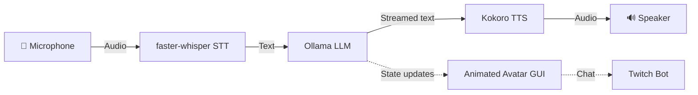

# PMC Overwatch — Tarkov AI Companion

> **⚠️ Work in Progress** — Under active development.

A real-time AI voice companion for Escape from Tarkov. Speak naturally and get instant, knowledgeable voice responses powered by a local LLM and neural TTS. Runs **entirely offline** on macOS — no paid APIs, no cloud services.

## ✨ Features

| Feature | Description |
|---------|-------------|
| **🎙 Voice Chat** | Natural speech-to-text → AI → text-to-speech pipeline |
| **🧠 Local AI Brain** | Ollama LLM with conversation memory and Tarkov expertise |
| **🎤 Offline STT** | faster-whisper speech recognition (fully local) |
| **🔊 Neural TTS** | Kokoro ONNX neural voice — warm, natural, female |
| **👩 Animated Avatar** | Frame-swapping expressions: idle, speaking, blinking |
| **📺 Twitch Bot** | Optional Twitch chat integration for streaming |

## 🛠 Tech Stack

| Layer | Technology |
|-------|-----------|
| LLM | [Ollama](https://ollama.ai) — `qwen2.5:1.5b` for fast responses |
| TTS | [Kokoro ONNX](https://github.com/thewh1teagle/kokoro-onnx) — neural voice synthesis |
| STT | [faster-whisper](https://github.com/SYSTRAN/faster-whisper) — CTranslate2 Whisper |
| GUI | [CustomTkinter](https://github.com/TomSchimansky/CustomTkinter) + PIL — dark UI |
| Streaming | [TwitchIO](https://github.com/TwitchIO/TwitchIO) — chat integration |

## 📋 Requirements

- macOS (Apple Silicon recommended)
- Python 3.11+
- [Ollama](https://ollama.ai) installed and running
- ~4 GB RAM minimum

## 🚀 Quick Start

```bash
# Clone
git clone https://github.com/Bossiq/Tarkov_AI_Frriend.git
cd Tarkov_AI_Frriend

# Setup
python3 -m venv venv
source venv/bin/activate
pip install -r requirements.txt

# Configure
cp .env.example .env

# Pull AI model (fast 1.5B model, ~1GB)
ollama pull qwen2.5:1.5b

# Run
python main.py
```

## ⚙️ Configuration

All settings live in `.env` — see [.env.example](.env.example) for full docs.

| Variable | Default | Description |
|----------|---------|-------------|
| `OLLAMA_MODEL` | `qwen2.5:1.5b` | LLM model (fast, 1GB) |
| `OLLAMA_NUM_CTX` | `1024` | Context window |
| `TTS_VOICE` | `af_heart` | Kokoro voice ID |
| `TTS_SPEED` | `1.1` | Speech speed |
| `WHISPER_MODEL` | `base` | STT model size |

## 📁 Project Structure

```
├── main.py             # Entry point — orchestrates all components
├── brain.py            # AI brain (Ollama + memory + personality)
├── voice_input.py      # Mic capture + adaptive VAD + Whisper STT
├── voice_output.py     # Kokoro TTS + async sentence pipeline
├── gui.py              # Animated avatar with frame-swapping
├── twitch_bot.py       # Optional Twitch chat integration
├── video_capture.py    # Optional webcam capture
├── logging_config.py   # Centralized logging
├── assets/
│   ├── avatar.png            # Idle expression
│   ├── avatar_speaking.png   # Speaking (mouth open)
│   └── avatar_blinking.png   # Blinking (eyes closed)
├── .env.example        # Environment template
├── requirements.txt    # Python dependencies
├── LICENSE             # MIT License
└── README.md
```

## 🏗 Architecture



### Why Python?

The bottleneck is the **LLM inference** (Ollama, native C++) and **TTS synthesis** (ONNX Runtime, native code). Python just orchestrates the pipeline — switching to Rust/C++ would not make these faster. The real speed lever is **model size** (1.5B vs 7B = 4x faster).

## 📄 License

MIT — see [LICENSE](LICENSE).

---

*Built by [Bossiq](https://github.com/Bossiq).*
