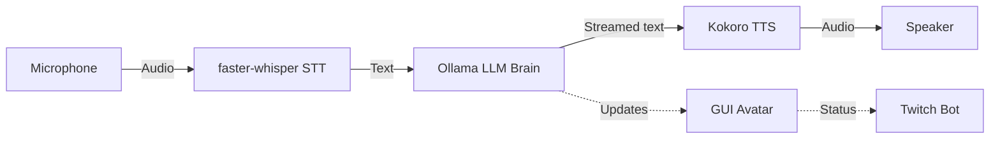

# PMC Overwatch — Tarkov AI Companion

> **⚠️ Work in Progress** — Under active development.

A real-time AI voice companion for Escape from Tarkov. Speak naturally and get instant, knowledgeable voice responses powered by a local LLM and neural TTS. Runs **entirely offline** on macOS — no paid APIs, no cloud services.

## ✨ Features

| Feature | Description |
|---------|-------------|
| **🎙 Voice Chat** | Natural speech-to-text → AI → text-to-speech pipeline |
| **🧠 Local AI Brain** | Ollama LLM with conversation memory and Tarkov expertise |
| **🎤 Offline STT** | faster-whisper speech recognition (fully local) |
| **🔊 Neural TTS** | Kokoro ONNX female voice — warm, natural, low-latency |
| **👩 Animated Avatar** | VTuber-style face with glow aura and voice EQ animation |
| **📺 Twitch Bot** | Optional Twitch chat integration for streaming |

## 🛠 Tech Stack

| Layer | Technology |
|-------|-----------|
| LLM | [Ollama](https://ollama.ai) — local Mistral inference |
| TTS | [Kokoro ONNX](https://github.com/thewh1teagle/kokoro-onnx) — neural voice synthesis |
| STT | [faster-whisper](https://github.com/SYSTRAN/faster-whisper) — CTranslate2 Whisper |
| GUI | [CustomTkinter](https://github.com/TomSchimansky/CustomTkinter) — modern dark UI |
| Streaming | [TwitchIO](https://github.com/TwitchIO/TwitchIO) — chat integration |

## 📋 Requirements

- macOS (Apple Silicon recommended)
- Python 3.11+
- [Ollama](https://ollama.ai) installed and running
- ~8 GB RAM minimum

## 🚀 Quick Start

```bash
# Clone
git clone https://github.com/Bossiq/Tarkov_AI_Frriend.git
cd Tarkov_AI_Frriend

# Setup
python3 -m venv venv
source venv/bin/activate
pip install -r requirements.txt

# Configure
cp .env.example .env
# Edit .env if needed

# Pull AI model
ollama pull mistral

# Run
python main.py
```

## ⚙️ Configuration

All settings live in `.env` — see [.env.example](.env.example) for full docs.

| Variable | Default | Description |
|----------|---------|-------------|
| `OLLAMA_MODEL` | `mistral` | LLM model |
| `OLLAMA_NUM_CTX` | `2048` | Context window size |
| `TTS_VOICE` | `af_heart` | Kokoro voice ID |
| `TTS_SPEED` | `1.1` | Speech speed |
| `WHISPER_MODEL` | `base` | Whisper model size |

## 📁 Project Structure

```
├── main.py            # Entry point — orchestrates all components
├── brain.py           # AI brain (Ollama LLM + conversation memory)
├── voice_input.py     # Mic capture + faster-whisper (with pre-buffer VAD)
├── voice_output.py    # Kokoro neural TTS + async pipeline
├── gui.py             # Animated avatar GUI (VTuber-style)
├── twitch_bot.py      # Optional Twitch chat bot
├── video_capture.py   # Optional webcam capture
├── logging_config.py  # Centralized logging
├── assets/
│   └── avatar.png     # AI companion avatar
├── .env.example       # Environment template
├── requirements.txt   # Python dependencies
├── LICENSE            # MIT License
└── README.md          # This file
```

## 🏗 Architecture



## 📄 License

MIT — see [LICENSE](LICENSE).

---

*Built with ❤️ for the Tarkov community by [Bossiq](https://github.com/Bossiq)*
