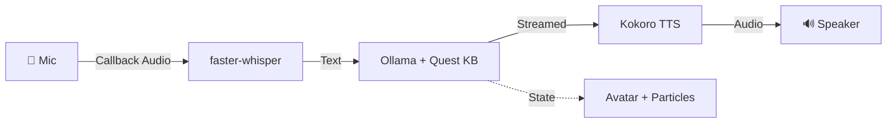

# PMC Overwatch — Tarkov AI Companion

> Real-time AI voice companion for Escape from Tarkov. Speak naturally, get instant voice responses with accurate quest knowledge. **Runs entirely offline on macOS.**

## ✨ Features

| Feature | Description |
|---------|-------------|
| **🎙 Voice Chat** | Speech → AI → Voice pipeline with natural conversation |
| **🧠 Tarkov Expert** | Complete quest database with 200+ quests, bosses, ammo, extracts |
| **🎤 Offline STT** | faster-whisper speech recognition (callback-based, never blocks) |
| **🔊 Neural TTS** | Kokoro ONNX — warm, natural female voice at 1.2x speed |
| **👩 Animated Avatar** | Photorealistic portrait with orbiting particles, glow ring, voice bars |
| **📺 Twitch Bot** | Optional Twitch chat integration |

## 🛠 Tech Stack

| Layer | Technology |
|-------|-----------|
| LLM | [Ollama](https://ollama.ai) — `qwen2.5:3b` + 12K char quest knowledge base |
| TTS | [Kokoro ONNX](https://github.com/thewh1teagle/kokoro-onnx) — neural voice |
| STT | [faster-whisper](https://github.com/SYSTRAN/faster-whisper) — CTranslate2 |
| GUI | [CustomTkinter](https://github.com/TomSchimansky/CustomTkinter) + Canvas animations |

## 🚀 Quick Start

```bash
git clone https://github.com/Bossiq/Tarkov_AI_Frriend.git
cd Tarkov_AI_Frriend
python3 -m venv venv && source venv/bin/activate
pip install -r requirements.txt
cp .env.example .env
ollama pull qwen2.5:3b
python main.py
```

## ⚙️ Configuration

| Variable | Default | Description |
|----------|---------|-------------|
| `OLLAMA_MODEL` | `qwen2.5:3b` | LLM model (2GB, balanced speed + knowledge) |
| `OLLAMA_NUM_CTX` | `4096` | Context window (fits quest reference) |
| `TTS_VOICE` | `af_heart` | Kokoro voice ID |
| `TTS_SPEED` | `1.2` | Speech speed |

## 📁 Project Structure

```
├── main.py             # Entry point — orchestrates everything
├── brain.py            # AI brain (Ollama + Tarkov knowledge + memory)
├── tarkov_data.py      # 200+ quests, bosses, ammo, maps (12K chars)
├── voice_input.py      # Callback-based mic + adaptive VAD + Whisper STT
├── voice_output.py     # Kokoro TTS + async sentence pipeline
├── gui.py              # Animated avatar with particles, glow, voice bars
├── twitch_bot.py       # Optional Twitch chat integration
├── video_capture.py    # Optional webcam capture
├── logging_config.py   # Centralized logging
├── assets/avatar.png   # Photorealistic AI companion portrait
├── .env.example        # Environment template
└── requirements.txt    # Dependencies
```

## 🏗 Architecture



### Design Decisions

- **Callback Audio**: Uses `queue.get(timeout=0.2)` — never blocks, timeouts always fire
- **12K Quest Knowledge**: Injected into system prompt for accurate answers from small models
- **Adaptive Silence**: Detects silence relative to speech volume, not absolute threshold
- **Particle Effects**: 16 orbiting particles + micro-sway make static avatar feel alive

## 📄 License

MIT — see [LICENSE](LICENSE).

---
*Built by [Bossiq](https://github.com/Bossiq)*
